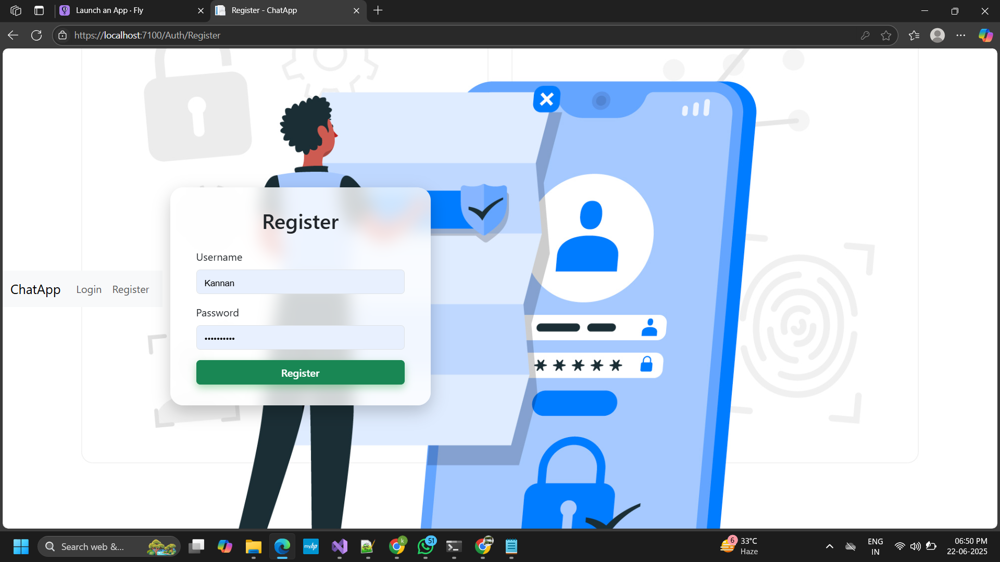
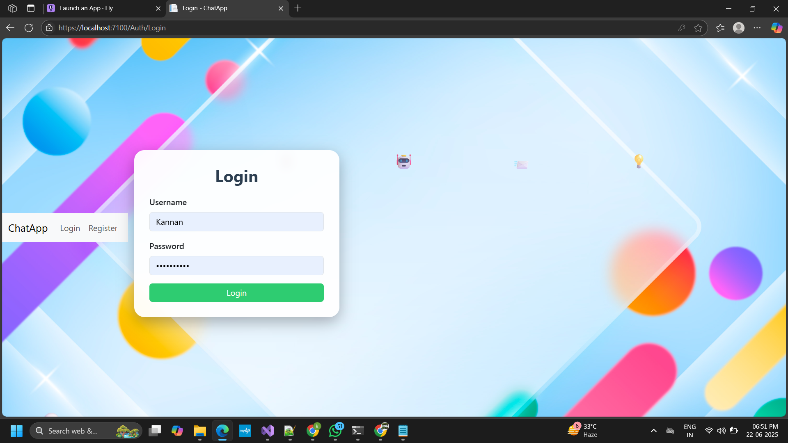
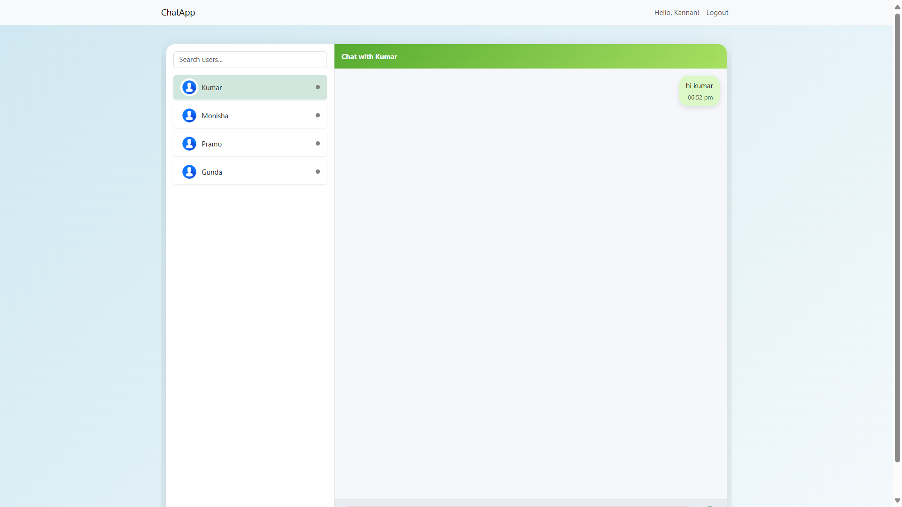
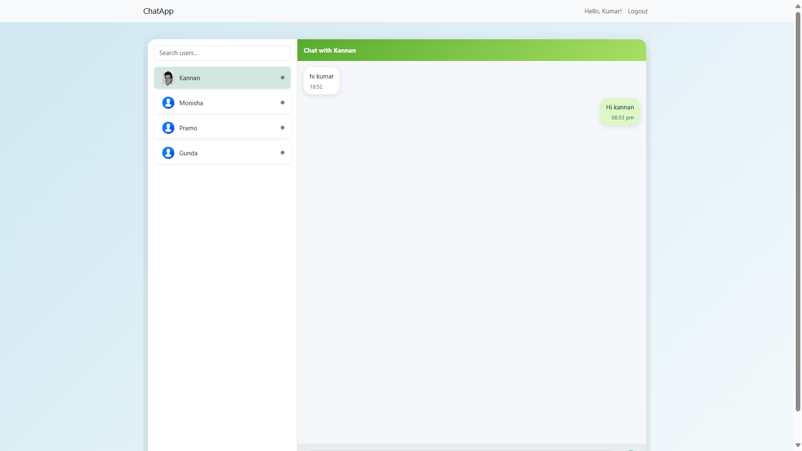
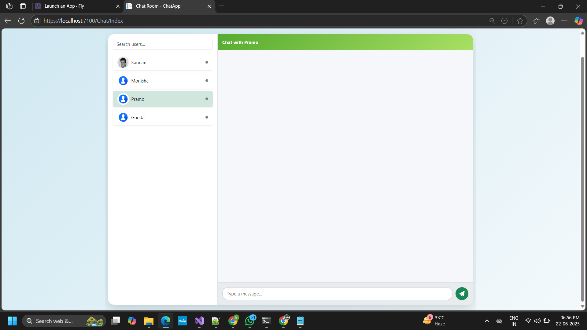
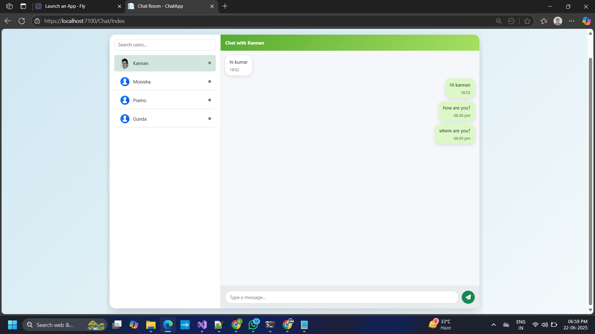

# 💬 ASP.NET Core Real-Time Chat App

A real-time chat application using **ASP.NET Core MVC**, **SignalR**, and **Entity Framework Core**, complete with animated login/register UI and persistent chat history. Built for clarity, scalability, and a clean modern interface.

---

## 🚀 Features

* 🔐 User registration/login with secure password hashing
* 💬 Real-time 1-to-1 messaging (SignalR)
* 🟢 Online/offline status indicators
* 📜 Chat history per user (database persistent)
* 🎨 Animated login/register pages with emoji background
* 📱 Responsive UI with Bootstrap 5
* 🔍 User search/filter support

---

## 🛠 Tech Stack

* ASP.NET Core MVC (v6.0+)
* SignalR for WebSocket messaging
* Entity Framework Core (SQL Server)
* Razor Views, Bootstrap 5
* Session-based auth
* C# + LINQ + JavaScript

---

## 📂 Folder Structure

```
CHAT/
├── Controllers/        # MVC Controllers (Auth, Chat)
├── Data/               # EF DbContext
├── Hubs/               # SignalR ChatHub
├── Helpers/            # Password hashing utilities
├── Models/             # EF Models (User, ChatMessage)
├── Views/
│   ├── Auth/           # Login.cshtml, Register.cshtml
│   ├── Chat/           # Index.cshtml
│   └── Shared/         # _Layout.cshtml
├── wwwroot/            # Static files (images, CSS, icons)
├── appsettings.json    # Configurations
├── Program.cs          # Entry point
├── README.md
└── docs/
    ├── architecture.md
    ├── diagram.png
    └── chat-screenshot.png
```

---

## ⚙️ Build & Run Instructions

### 🧱 Build

```bash
# Restore dependencies
dotnet restore

# Build the application
dotnet build
```

### ▶️ Run

```bash
# Run the app
dotnet run
```

📦 Required NuGet Packages
---
Make sure the following packages are installed (via *.csproj or NuGet):

Microsoft.AspNetCore.Identity.EntityFrameworkCore (v8.0.0)

Microsoft.EntityFrameworkCore.SqlServer (v8.0.0)

Microsoft.EntityFrameworkCore.Sqlite (v8.0.0) (optional for SQLite support)

Microsoft.EntityFrameworkCore.Tools (v8.0.0)
---
```
https://localhost:7100
```

### 🧚 Test (Manual UI Testing)

1. Register a user.
2. Open two different browsers/logins.
3. Send real-time messages between them.
4. Refresh to check message history.

---

## 🔒 Security Basics Ensured

* Passwords stored as hashed (Identity hasher)
* Session auth (no tokens or JWTs, scoped per browser)
* XSS-safe views via Razor engine (HTML-encoded by default)
* Anti-Forgery Token (`@Html.AntiForgeryToken`) in all forms
* SQL Injection prevented by EF Core parameterization

---

## 📸 UI Preview

| Register Page | Login Page |
|---------------|------------|
|  |  |

| User Panel | Chat View |
|------------|-----------|
|  |  |

| Chat List | Sample |
|-----------|--------|
|  |  |

---

## 👨‍💼 Developer

**Kannadhasan A**
GitHub: [yourusername](https://github.com/yourkannan)

---


